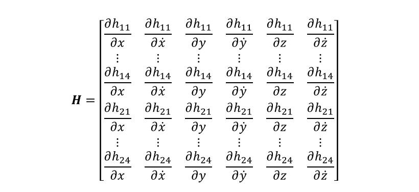

[](https://zenodo.org/badge/latestdoi/676430940)


# Tosipaikka - Bluetooth Direction Finding

Bluetooth Direction Finding -tekniikka eli Bluetooth-radiosuunnin perustuu Bluetooth-signaalin kulkusuunnan mittaukseen liikkuvan tunnisteen ja kiinteän ankkurin välillä.

Bluetooth-signaalin kulkusuunta voidaan määrittää kahdella eri menetelmällä. Saapumiskulman (Angle of Arrival, AoA) mittauksessa kiinteä ankkuri laskee liikkuvalta tunnisteelta tulevan signaalin suuntakulman, kun taas lähtökulman (Angle of Departure, AoD) mittauksessa liikkuva tunniste laskee kiinteältä ankkurilta tulevan signaalin suuntakulman.

Tämä sovellus on kehitetty toimimaan yhdessä saapumiskulman mittausta hyödyntävän u-blox XPLR-AOA-2 -kehityssarjan kanssa. Sovelluksessa ajetaan UDP-palvelinpistoketta, joka vastaanottaa kehityssarjan antennilevyjen (C211) mittaamia Bluetooth-signaalin saapumiskulmia.

Saapumiskulmien lähetys sovellukselle tapahtuu antennilevyjen taakse liitettyjen, erikseen ostettujen u-blox EVK-ODIN-W262 -piirikorttien avulla.

Sovellus laskee vastaanottamiensa saapumiskulmien ja laajennetun Kalman suotimen avulla kehityssarjaan kuuluvan Bluetooth-tunnisteen (C209) sijainnin sisätilapaikannusjärjestelmän omassa koordinaatistossa.

Laskettu sijainti muunnetaan WGS84-järjestelmän pituus- ja leveysasteiksi, jotta tunnisteen sijainti voidaan näyttää ulkoisessa karttasovelluksessa. Paikkatiedon lähetys sovellukselta karttasovellukselle tapahtuu erillisen MQTT-palvelimen kautta (kuvio 1).


**Kuvio 1.** Toimintakaavio.

Huomatus: EVK-ODIN-W262-piirikortit ja tietokone, jolla sovellusta ajetaan, tulee olla samassa langattomassa WLAN-verkossa.

Kattasovelluksena voidaan käyttää esimerkiksi Tosipaikka-hankkeessa aiemmin tehtyä [verkkosovellusta](https://github.com/SeAMKedu/tosipaikka-indoor-positioning) tai Node-RED -ohjelman [worldmap](https://flows.nodered.org/node/node-red-contrib-web-worldmap)-laajennosta.

## Laitteisto


**Kuva 1.** Kehityssarjan Bluetooth-tunnisteet ja antennilevyt, joiden taakse on liitetty EVK-ODIN-W262-piirikortti.

Laitteisto koostuu [u-blox XPLR-AOA-2](https://www.u-blox.com/en/product/xplr-aoa-2-kit) -kehityssarjasta, joka sisältää neljä antennilevyä (C211) ja neljä Bluetooth-tunnistetta (C209). Jokaisen antennilevyn taakse on lisäksi liitetty [u-blox EVK-ODIN-W262](https://www.u-blox.com/en/product/evk-odin-w2) -piirikortti, joka mahdollistaa saapumiskulmien mittausdatan langattoman tiedonsiirron antennilevyltä sovellukselle WiFi-verkon välityksellä.

## Saapumiskulmat, (Angle of Arrival, AoA)

u-blox XPLR-AOA-2 -kehityssarjan Bluetooth-tunniste lähettää signaalia valitun aikavälin mukaisesti. Vaihtoehtoina ovat 20, 100 ja 1000 millisekuntia, joista valmistajan dokumentaatio suosittelee käytettäväksi 20 millisekuntia.

Antennilevyissä on asetettu viisi antennia kallellaan olevan L-kirjaimen muotoon. Kun antennilevy vastaanottaa Bluetooth-tunnisteen lähettämän signaalin, antennilevyssä oleva laiteohjelmisto laskee vaihe-eron kunkin antennin välillä määrittääkseen tunnisteen suunnan suhteessa antennilevyyn. Suunta ilmaistaan kahdella saapumiskulmalla: atsimuuttikulmalla *φ* ja korotuskulmalla *θ* (kuvio 2).


**Kuvio 2.** Saapumiskulmat.

Atsimuuttikulma (-90°..+90°) on antennilevyn ja tunnisteen välinen suuntakulma vaakatasossa. Atsimuuttikulma on negatiivinen, kun tunniste on antennista katsottuna vasemmalla puolella ja positiivinen, kun tunniste on oikealla puolella (kuvio 3).

Korotuskulma (-90°..+90°) on antennilevyn ja tunnisteen välinen suuntakulma pystysuunnassa. Korotuskulma on positiivinen, kun tunniste on antennista katsottuna yläpuolella ja negatiivinen, kun tunniste on alapuolella (kuvio 3).


**Kuvio 3.** Saapumiskulmien etumerkit.

## +UUDF-viesti

Antennilevyssä oleva u-connectLocate-ohjelma laskee Bluetooth-signaalin saapumiskulmat. Laskennan tulos voidaan lukea +UUDF-viestistä suoraan antennilevyn USB-portin kautta. Vaihtoehtoinen tapa on liittää antennilevyn taakse EVK-ODIN-W262-piirikortti, jolloin sama viesti voidaan lukea langattomasti vastaanottamalla viesti UDP-palvelinpistokkeen avulla, kuten tässä sovelluksessa on tehty.

+UUDF-viestin parametrit on kuvattu alla olevassa taulukossa.

```
+UUDF:<eddystone_id>,<rssi>,<atsimuuttikulma>,<korotuskulma>,<na>,<kanava>,<ankkuri_id>,<kayttajadata>,<aikaleima_ms>
```

| Parametri | Datatyyppi | Kuvaus |
|---|---|---|
| eddystone_id | str | Eddystone ID |
| rssi| int | Ensimmäisen polarisaation RSSI |
| atsimuuttikulma | int | Atsimuuttikulma, -90°..+90° |
| korotuskulma | int | Korotuskulma, -90°..+90° |
| na | - | Ei toistaiseksi käytössä |
| kanava | int | Kanava, josta kulmat laskettiin |
| ankkuri_id | str |Antennilevyn yksilöllinen ID |
| kayttajadata | str | Käyttäjän määrittämä data |
| aikaleima_ms | int | Aika käynnistyksestä millisekunteina |

Alla on esimerkki +UUDF-viestistä.

```
+UUDF:6C1DEBA41845,-56,-11,20,0,39,"6C1DEBA79D14","",746675
```

## Sijainnin laskeminen saapumiskulmien avulla

Laajennettu kalman suodin laskee Bluetooth-tunnisteen sijainnin neljän atsimuuttikulman ja neljän korotuskulman avulla (kuvio 4).


**Kuvio 4.** Saapumiskulmat ja tunnisteen sijainti.

Laskuissa on kuitenkin otettava huomioon antennilevyjen asettelu suhteessa sisätilapaikannusjärjestelmän koordinaatistoon.

Laskuissa käytettävät atsimuuttikulmat saadaan yhtälöstä:

*φ* = *φ_ankkuri* - *φ_mitattu*,

jossa

* *φ_ankkuri* on antennilevyn kulma suhteessa positiiviseen x-akseliin
* *φ_mitattu* on antennilevyn mittaama atsimuuttikulma

Kuviossa 5 on esimerkki tapauksesta, jossa antennilevyn atsimuuttikulma positiivisen x-akselin suhteen on +45° ja mitattu atsimuuttikulma on -10°. Kalman suodin käyttää laskuissaan täten atsimuuttikulmaa -45°-(-10) = +55°.


**Kuvio 5.** Atsimuuttikulma.

Laskuissa käytettävä korotuskulma saadaan puolestaan yhtälöstä:

*θ* = *θ_ankkuri* + *θ_mitattu*,

jossa

* *θ_ankkuri* on antennilevyn kulma suhteessa xy-tasoon
* *θ_mitattu* on antennilevyn mittaama korotuskulma

Kuviossa 6 on esimerkki tapauksesta, jossa antennilevyn korotuskulma xy-tason suhteen on -10° ja mitattu korotuskulma on -10°. Kalman suodin käyttää laskuissaan täten korotuskulmaa -10°+(-10°) = -20°.


**Kuvio 6.** Korotuskulma.

## Kalman suodin

Kalman suotimessa käytetään mallia, jossa nopeus oletetaan vakioksi. Tila *x* on siten *x* = [x ẋ y ẏ z ż]ᵀ.

Tunnisteen sijainti suhteessa antennilevyyn ilmaistaan pallokoordinaatistossa etäisyyden *r*, atsimuuttikulman *φ*, ja korotuskulman *θ* avulla. Karteesiset koordinaatit x, y, ja z muunnetaan pallokoordinaatteihin kuvion 7 mukaisesti.


**Kuvio 7.** Pallokoordinaatit.

Kulmien yhtälöt ovat arkustangentin takia epälineaarisia, joten tunnisteen sijainnin laskemiseen on käytettävä laajennettua Kalman suodinta. Linearisointi tapahtuu osittaisderivaatan avulla (kuviot 8-10).



**Kuvio 8.** Matriisi H.

missä


**Kuvio 9.** h_1i(x) ja h_2i(x).

ja


**Kuvio 10.** Osittaisderivaatat.

## u-blox EVK-ODIN-W262 -piirikortin konfigurointi

UDP-palvelinpistokkeen IP-osoite asetetaan EVK-ODIN-W262-piirikorttiin seuraavasti.

1. Irrota EVK-ODIN-W262 antennilevystä
1. Laita 2 jumpperia kohtaan J13 (alemmat pinnit, UART1)
1. Liitä EVK-ODIN-W262 tietokoneeseen USB-kaapelin kautta
1. Avaa s-center ohjelma
1. Avaa portti, Baudrate = 1000000
1. Paina *AT-mode* painiketta
1. Palauta tehdasasetukset:
    * AT+UFACTORY
    * AT+CPWROFF
1. Sulje portti
1. Avaa portti, Baudrate = 115200
1. Paina *AT-mode* painiketta
1. Kirjoita tekstikenttään seuraavat komennot ja paina ENTER (HUOM: OK-ilmoitus ei näy):
    * AT+UMRS=115200,2,8,1,1,0
    * AT&W
    * AT+CPWROFF
1. Paina *AT-mode* painiketta
1. Aja seuraavat komennot:
    * AT+UWSC=0,0,1
    * AT+UWSC=0,2,"myNetworkSSID"
    * AT+UWSC=0,5,2
    * AT+UWSC=0,8,"myNetworkPassword"
    * AT+UWSC=0,100,2
    * AT+UWSC=0,107,0
    * AT+UWSC=0,300,0
    * AT+UWSC=0,301,1
    * AT+UWSCA=0,1
    * AT+UWSCA=0,3
    * AT+UDDRP=0,"udp://myServerIP:myServerPort/",2
    * AT+UMSM=1
    * AT+UMRS=1000000,2,8,1,1,0
    * AT&W
    * AT+CPWROFF
1. Sulje portti
1. Irrota USB-kaapeli
1. Ota EVK-ODIN-W262 piirilevyltä jumpperit pois kohdasta J13
1. Liitä EVK-ODIN-W262 antennilevyyn

## Esivalmistelut

* Asettele antennilevyt suorakulmion muotoon siten, että jokainen antennilevy osoittaa kohti alueen keskipistettä.
* Mittaa tai laske jokaisen antennilevyn atsimuuttikulma suhteessa antennttilevyjen muodostaman alueen positiiviseen x-akseliin ja korotuskulma suhteessa alueen xy-tasoon (kuvio 11).


**Kuvio 11.** Antennilevyjen asettelu.

* Kirjoita antennilevyjen koordinaatit ja kulmien arvot [config.py](/config.py) tiedostoon.
* Asenna ohjelmistoriippuvuudet komennolla:
```
pip install -r requirements.txt
```

## Sovelluksen ajo

Käynnistä sovellus komennolla:
```
python app.py
```

Vinkki: Toisinaan käy niin, että kun sovellus sammutetaan ja käynnistetään uudestaan, joltain antennilevyltä ei tule enää mittausdataa. Tämä ongelma ratkeaa käyttämällä antennilevyä hetken aikaa virrattomana.

## Tekijätiedot

Hannu Hakalahti, Asiantuntija TKI, Seinäjoen ammattikorkeakoulu

## TosiPaikka-hanke

Tämä sovellus on kehitetty osana Tosiaikaisen paikkadatan hyödyntäminen teollisuudessa (TosiPaikka) -hanketta, jota rahoittaa Etelä-Pohjanmaan liitto (EAKR). Lisätietoja hankkeesta löytyy hankkeen [kotisivuilta](https://projektit.seamk.fi/alykkaat-teknologiat/tosipaikka/).
